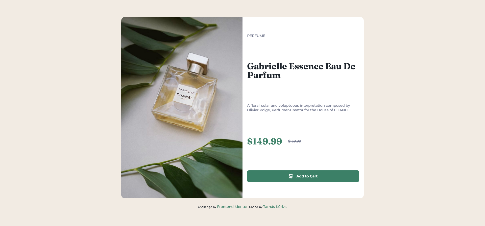

# Frontend Mentor - Product preview card component solution

This is a solution to the [Product preview card component challenge on Frontend Mentor](https://www.frontendmentor.io/challenges/product-preview-card-component-GO7UmttRfa). Frontend Mentor challenges help you improve your coding skills by building realistic projects. 

## Table of contents

- [Overview](#overview)
  - [The challenge](#the-challenge)
  - [Screenshot](#screenshot)
  - [Links](#links)
- [My process](#my-process)
  - [Built with](#built-with)
  - [What I learned](#what-i-learned)
  - [Useful resources](#useful-resources)
- [Author](#author)

## Overview

### The challenge

Users should be able to:

- View the optimal layout depending on their device's screen size
- See hover and focus states for interactive elements

### Screenshot



### Links

- Solution URL: [Add solution URL here](https://your-solution-url.com)

## My process

### Built with

- Semantic HTML5 markup
- CSS custom properties
- Flexbox
- Mobile-first workflow

### What I learned

```html
<header>
        <picture>
          <source srcset="images/image-product-mobile.jpg" media="(max-width: 991px)">
          <source srcset="images/image-product-desktop.jpg">
          
        </picture>
      </header>
```

### Useful resources

- [W3Schools Picture Element](https://www.w3schools.com/tags/tag_picture.asp) - This helped me to use multiple images in this project.

## Author
- Frontend Mentor - [@korizst](https://www.frontendmentor.io/profile/korizst)
